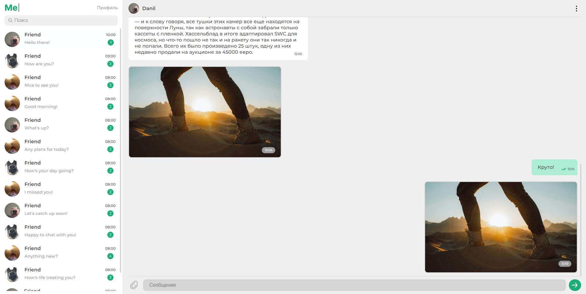

## **About**

Веб-приложение онлайн месседжера "Me"

## **Installing**

- `npm install` — установка стабильной версии,
- `npm run dev` — запуск версии для разработчика,
- `npm run build` — сборка стабильной версии.

## **Frontend Testing**

Проект на Netlify: https://boymep-messager.netlify.app/

Параметры для входа по умолчанию:
Логин - user
Пароль - user

Текущие страницы:
/login
/reg
/chats
/chat
/profile

## **Figma Layout**

https://www.figma.com/file/jF5fFFzgGOxQeB4CmKWTiE/Chat_external_link?node-id=0%3A1&mode=dev

(Из-за работы пока не успел сделать собственный макет, использовал предоставленный, но внес свои изменения. Во время ревью постараюсь заняться макетом отдельно)

## **Browser support**

| Chrome                            | Safari                            | Opera                           | Yandex Browser                            | Chrome for Mobile |
| --------------------------------- | --------------------------------- | ------------------------------- | ----------------------------------------- | ----------------- |
|  |  |  |  |

## **Usage Examples**

### **Team**

Danil Panov (@boymep)
